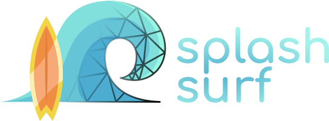

# splashsurf
Surface reconstruction for particle data from SPH simulations, written in Rust.



This is a basic but high-performance implementation of surface reconstruction for SPH using marching cubes.
The output of this tool is the reconstructed triangle surface mesh of the fluid.
At the moment it does not compute normals or other additional data.
As input, it supports particle positions from .vtk files and binary .xyz files. In addition, required parameters are the kernel radius and particle radius (to compute the volume of particles) used for the original SPH simulation as well as the surface threshold.

The implementation first computes the density of each particles using the typical SPH approach with a cubic kernel. This density is then interpolated onto a sparse grid using spatial hashing in the support radius of each particle. Finally, the marching cubes reconstruction is performed only in those grid cells where the density values cross the surface threshold.

Due the use of hash maps in release mode and multi-threading (if enabled), the output of this implementation is not deterministic.
To help with debugging, the implementation switches to binary trees in debug builds.

## Usage

```
USAGE:
    splashsurf.exe [FLAGS] [OPTIONS] <input-file> --cube-size <cube-size> --kernel-radius <kernel-radius> --particle-radius <particle-radius> --surface-threshold <surface-threshold>

FLAGS:
    -h, --help            Prints help information
        --mt-files        Whether to enable multi-threading to process multiple input files in parallel, conflicts with
                          --mt-particles
        --mt-particles    Whether to enable multi-threading for a single input file by processing chunks of particles in
                          parallel, conflicts with --mt-files
    -d                    Whether to enable the use of double precision for all computations (disabled by default)
    -V, --version         Prints version information

OPTIONS:
        --cube-size <cube-size>
            The marching cubes grid size in multiplies of the particle radius

        --domain-max <domain-max> <domain-max> <domain-max>
            Upper corner of the domain where surface reconstruction should be performed, format:domain-
            max=x_max;y_max;z_max (requires domain-min to be specified)
        --domain-min <domain-min> <domain-min> <domain-min>
            Lower corner of the domain where surface reconstruction should be performed, format: domain-
            min=x_min;y_min;z_min (requires domain-max to be specified)
        --kernel-radius <kernel-radius>
            The kernel radius used for building the density map in multiplies of the particle radius

        --output-dir <output-dir>                              Optional base directory for all output files
        --output-dm-grid <output-dm-grid>
            Optional filename for writing the grid representation of the intermediate density map to disk

        --output-dm-points <output-dm-points>
            Optional filename for writing the point cloud representation of the intermediate density map to disk

    -o <output-file>                                           Filename for writing the reconstructed surface to disk
        --particle-radius <particle-radius>                    The particle radius of the input data
        --rest-density <rest-density>                          The rest density of the fluid [default: 1000.0]
        --splash-detection-radius <splash-detection-radius>
            If a particle has no neighbors in this radius (in multiplies of the particle radius) it is considered as a
            free particles
        --surface-threshold <surface-threshold>
            The iso-surface threshold for the density, i.e. value of the reconstructed density that indicates the fluid
            surface

ARGS:
    <input-file>    Path to the input file where the particle positions are stored (supported formats: VTK, binary
                    XYZ)
```
For example:
```
splashsurf "/home/user/canyon.xyz" --output-dir="/home/user/temp" --particle-radius=0.011 --kernel-radius=4.0 --cube-size=1.5 --surface-threshold=0.6 --mt-particles
```
With these parameters, a scene with 13353401 particles is reconstructed in less than 26.5s on a i7 8700K:
```
[2020-05-12T20:22:28.441899+02:00][splashsurf::reconstruction][INFO] Loading dataset from "/home/user/canyon.xyz"...
[2020-05-12T20:22:28.582334+02:00][splashsurf::reconstruction][INFO] Loaded dataset with 13353401 particle positions.
[2020-05-12T20:22:28.628091+02:00][splashsurf_lib][INFO] Minimal enclosing bounding box of particles was computed as: AxisAlignedBoundingBox { min: [-25.0060978, -5.0146289, -40.0634613], max: [24.4994926, 18.3062096, 39.7757950] }
[2020-05-12T20:22:28.628109+02:00][splashsurf_lib][INFO] Using a grid with 6002x2828x9679 points and 6001x2827x9678 cells of edge length 0.0165.
[2020-05-12T20:22:28.628112+02:00][splashsurf_lib][INFO] The resulting domain size is: AxisAlignedBoundingBox { min: [-49.7588959, -16.6750488, -79.9830933], max: [49.2576065, 29.9704514, 79.7039032] }
[2020-05-12T20:22:28.628115+02:00][splashsurf_lib][INFO] Starting neighborhood search...
[2020-05-12T20:22:30.943285+02:00][splashsurf_lib][INFO] Computing particle densities...
[2020-05-12T20:22:31.967240+02:00][splashsurf_lib::density_map][INFO] Starting construction of sparse density map for 13353401 particles...
[2020-05-12T20:22:31.986757+02:00][splashsurf_lib::density_map][INFO] To take into account the kernel evaluation radius, the allowed domain of particles was restricted to: AxisAlignedBoundingBox { min: [-49.7093468, -16.6254997, -79.9335403], max: [49.2080574, 29.9209023, 79.6543503] }
[2020-05-12T20:22:50.536691+02:00][splashsurf_lib::density_map][INFO] Sparse density map with 31519986 point data values was constructed.
[2020-05-12T20:22:50.536710+02:00][splashsurf_lib::density_map][INFO] Construction of sparse density map done.
[2020-05-12T20:22:50.556266+02:00][splashsurf_lib::marching_cubes][INFO] Starting interpolation of cell data for marching cubes...
[2020-05-12T20:22:54.175469+02:00][splashsurf_lib::marching_cubes][INFO] Generated cell data for marching cubes with 3009863 cells and 3011516 vertices.
[2020-05-12T20:22:54.175481+02:00][splashsurf_lib::marching_cubes][INFO] Interpolation done.
[2020-05-12T20:22:54.175484+02:00][splashsurf_lib::marching_cubes][INFO] Starting marching cubes triangulation of 3009863 cells...
[2020-05-12T20:22:54.329789+02:00][splashsurf_lib::marching_cubes][INFO] Generated surface mesh with 6016212 triangles and 3011516 vertices.
[2020-05-12T20:22:54.329799+02:00][splashsurf_lib::marching_cubes][INFO] Triangulation done.
[2020-05-12T20:22:54.345902+02:00][splashsurf::reconstruction][INFO] Writing surface mesh to "/home/user/temp/canyon_surface.xyz"...
[2020-05-12T20:22:54.674636+02:00][splashsurf::reconstruction][INFO] Done.
[2020-05-12T20:22:54.710916+02:00][splashsurf][INFO] Finished processing all inputs.
[2020-05-12T20:22:54.710934+02:00][splashsurf][INFO] surface reconstruction cli: 100.00%, 26269.02ms/call @ 0.04Hz
[2020-05-12T20:22:54.710936+02:00][splashsurf][INFO]   loading particle positions: 0.53%, 140.43ms/call @ 0.04Hz
[2020-05-12T20:22:54.710938+02:00][splashsurf][INFO]   reconstruct_surface: 98.08%, 25763.55ms/call @ 0.04Hz
[2020-05-12T20:22:54.710939+02:00][splashsurf][INFO]     compute minimum enclosing aabb: 0.18%, 45.76ms/call @ 0.04Hz
[2020-05-12T20:22:54.710941+02:00][splashsurf][INFO]     neighborhood_search: 8.99%, 2315.17ms/call @ 0.04Hz
[2020-05-12T20:22:54.710942+02:00][splashsurf][INFO]       parallel_generate_cell_to_particle_map: 15.43%, 357.13ms/call @ 0.04Hz
[2020-05-12T20:22:54.710944+02:00][splashsurf][INFO]       get_cell_neighborhoods_par: 2.62%, 60.63ms/call @ 0.04Hz
[2020-05-12T20:22:54.710945+02:00][splashsurf][INFO]       calculate_particle_neighbors_par: 57.23%, 1325.03ms/call @ 0.04Hz
[2020-05-12T20:22:54.710947+02:00][splashsurf][INFO]     parallel_compute_particle_densities: 1.20%, 308.73ms/call @ 0.04Hz
[2020-05-12T20:22:54.710948+02:00][splashsurf][INFO]     parallel_generate_sparse_density_map: 72.15%, 18589.03ms/call @ 0.04Hz
[2020-05-12T20:22:54.710949+02:00][splashsurf][INFO]     triangulate_density_map: 14.71%, 3789.63ms/call @ 0.04Hz
[2020-05-12T20:22:54.710951+02:00][splashsurf][INFO]       interpolate_points_to_cell_data: 95.50%, 3619.22ms/call @ 0.04Hz
[2020-05-12T20:22:54.710952+02:00][splashsurf][INFO]         generate_iso_surface_vertices: 68.66%, 2484.79ms/call @ 0.04Hz
[2020-05-12T20:22:54.710953+02:00][splashsurf][INFO]         relative_to_threshold_postprocessing: 31.34%, 1134.40ms/call @ 0.04Hz
[2020-05-12T20:22:54.710955+02:00][splashsurf][INFO]       triangulate: 4.50%, 170.41ms/call @ 0.04Hz
[2020-05-12T20:22:54.710956+02:00][splashsurf][INFO]   write surface mesh to file: 1.25%, 328.75ms/call @ 0.04Hz
```

## License

For license information of this project, see the LICENSE file.
The splashsurf logo is based on two graphics ([1](https://www.svgrepo.com/svg/295647/wave), [2](https://www.svgrepo.com/svg/295652/surfboard-surfboard)) published on SVG Repo under a CC0 ("No Rights Reserved") license.
